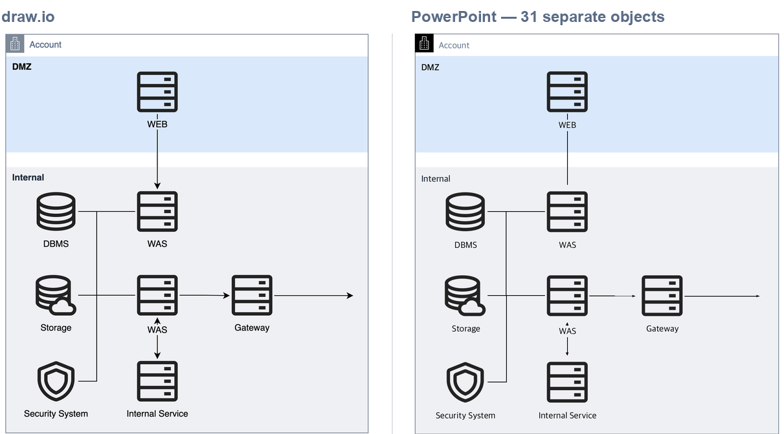

# drawio2pptx

Put a draw.io diagram into PowerPoint as **individually editable objects** — not a flat image.

Boxes stay boxes, arrows stay arrows, text stays text. You can move one server icon,
recolour a zone, or fix a typo in a label without going back to draw.io.

```
drawio2pptx diagram.drawio
```



<sub>Right-hand panel is the tool's own re-render of the saved `.pptx` (see
[Verifying output](#verifying-output)), not a PowerPoint screenshot.</sub>

## What you get

| draw.io | PowerPoint |
| --- | --- |
| Plain rectangles and containers | Native autoshapes — fill, border, dash, all editable |
| Labels | Real text boxes — font, size, weight, colour preserved |
| Edges, including orthogonal routes | Freeform connectors with the original arrowheads |
| AWS / GCP / Cisco / Veeam stencils | High-resolution PNG per icon, placed to the pixel |
| Embedded images | Extracted at original resolution, crops honoured |

Stencil icons stay raster — PowerPoint has no way to express an mxGraph stencil, so
draw.io renders each one and the result is placed as its own picture. Everything else
is native.

## Install

Needs **draw.io desktop**, which does the shape rendering:

```bash
brew install --cask drawio            # macOS
sudo snap install drawio              # Linux
winget install JGraph.Draw            # Windows
```

Then install this repo:

```bash
git clone <this repo> && cd drawio2pptx
pip install .
```

Or run it straight from a clone without installing:

```bash
uv run --with python-pptx --with pillow python -m drawio2pptx diagram.drawio
```

## Usage

```bash
# simplest: diagram.drawio -> diagram.pptx, one 16:9 slide
drawio2pptx diagram.drawio

# name the output
drawio2pptx diagram.drawio -o deck.pptx

# drop it onto slide 2 of a deck you already have, wiping that slide first
drawio2pptx diagram.drawio --into deck.pptx --slide 2 --replace

# every page of a multi-page diagram, one slide each
drawio2pptx diagram.drawio --all-pages -o deck.pptx

# check the result: writes draw.io's render, this slide, and a difference map
drawio2pptx diagram.drawio --verify check.png
```

Useful flags:

| Flag | Purpose |
| --- | --- |
| `--page N` / `--all-pages` / `--list-pages` | Multi-page diagrams |
| `--slide-size 16:9 \| 4:3 \| 16:10 \| auto \| 13.333x7.5` | Slide dimensions for a new deck |
| `--margin 0.04` | Leave a border instead of filling the slide |
| `--ea-font "Malgun Gothic"` | Pin the CJK font so Korean/Japanese labels don't reflow |
| `--font Arial` | Override the latin font |
| `--scale 8` | Higher-resolution icons (default 6, ~370 dpi at slide width) |
| `--drawio /path/to/drawio` | If auto-detection misses it (or set `DRAWIO_BIN`) |
| `--keep-workdir` | Keep the intermediate renders when something looks wrong |

## As a library

```python
from drawio2pptx import convert

result = convert("diagram.drawio", "deck.pptx", slide_size="16:9", margin=0.03)
print(result.path, result.counts)
# deck.pptx {'rect': 10, 'picture': 28, 'line': 22, 'text': 39}
```

## As a Claude Code skill

The skill lives at `.claude/skills/drawio2pptx/`, so Claude Code picks it up automatically
when you work inside this repo. To make it available everywhere, symlink it into your
personal skills directory:

```bash
ln -s "$PWD/.claude/skills/drawio2pptx" ~/.claude/skills/drawio2pptx
```

Then "put this diagram in the deck" is enough — see
[the skill](.claude/skills/drawio2pptx/SKILL.md).

## How it works

Three ideas do the heavy lifting:

1. **A frame rectangle pins the coordinate system.** An invisible rect is injected into
   a copy of the diagram before every export, so each render shares one origin and a
   crop at known coordinates lands exactly where it belongs. draw.io's PNG export always
   crops to the graph bounds, which otherwise shift from render to render.
2. **Label boxes and edge routes are read back out of draw.io's SVG export**, keyed by
   `data-cell-id`. Re-implementing mxGraph's label placement and orthogonal router would
   never match; the SVG already has the answer.
3. **Non-overlapping stencils share a render pass.** Each draw.io invocation costs a few
   seconds, so shapes are packed into layers by overlap. A typical diagram needs one or
   two passes instead of one per icon.

## Verifying output

`--verify` writes a three-panel image: draw.io's own export, this tool's slide
re-rendered from the saved `.pptx`, and a difference map. The renderer is approximate —
it exists to catch shapes in the wrong place, not to imitate PowerPoint's text layout —
so expect thin outlines around glyphs and strokes in the diff. Solid filled regions in
the difference map mean something actually moved.

## Development

```bash
pip install -e ".[dev]"
pytest -q          # end-to-end tests skip themselves without draw.io installed
ruff check .
```

The end-to-end tests need draw.io desktop; without it they skip and only the
parsing and geometry tests run.

Regenerate the README image after touching the renderer:

```bash
drawio2pptx examples/sample.drawio -o /tmp/s.pptx --verify /tmp/check.png
python tools/make_preview.py /tmp/check.png examples/preview.png "PowerPoint — 31 separate objects"
```

## Limits

- Curved and rounded edges are flattened to their anchor points.
- Stencil icons are raster; their colours can't be changed in PowerPoint.
- Rotated shapes and swimlane containers are not handled yet.
- Compressed `.drawio` files must be re-saved as uncompressed XML
  (draw.io: **Extras → Edit Diagram**, uncheck *Compressed*).

## License

MIT
